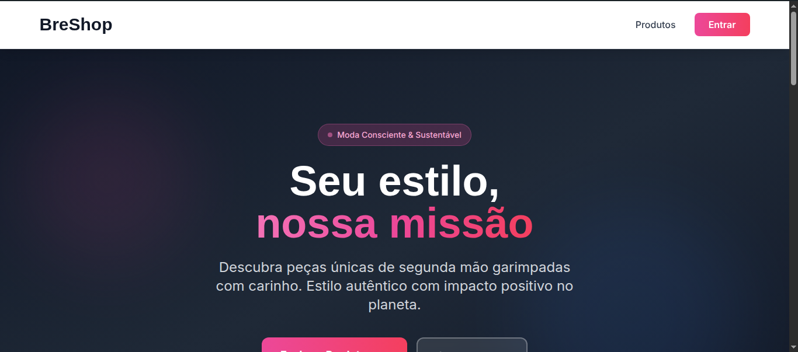
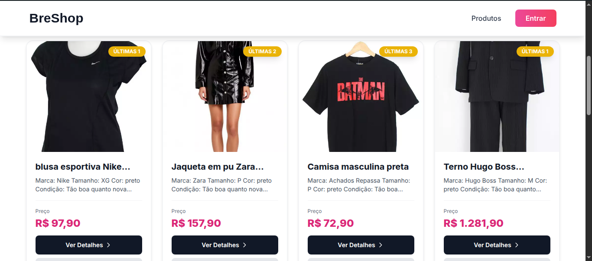
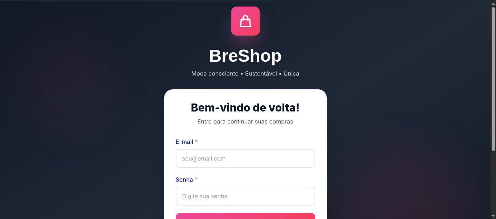
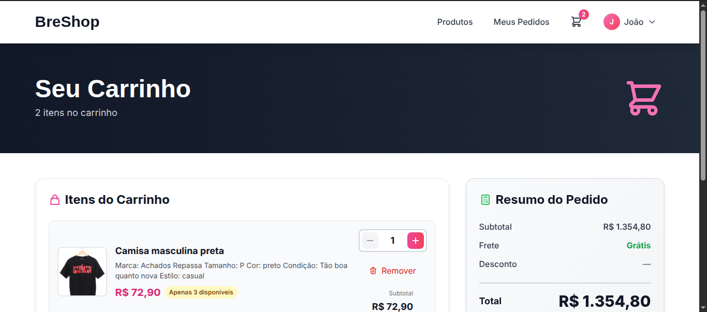
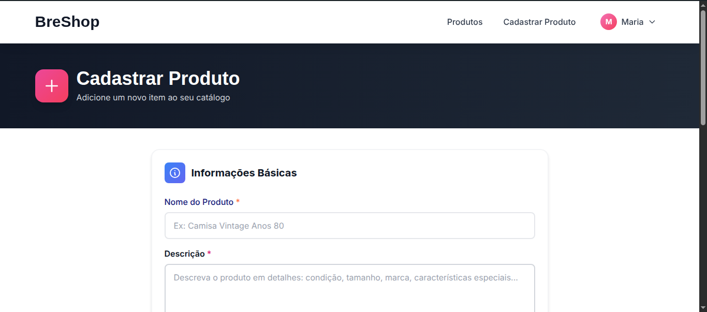
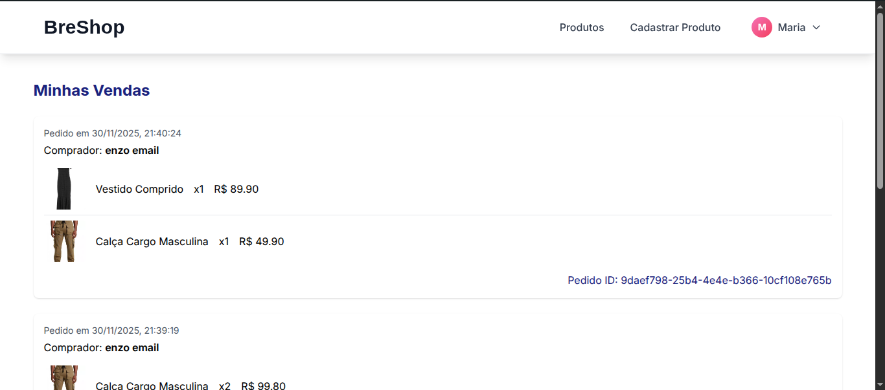
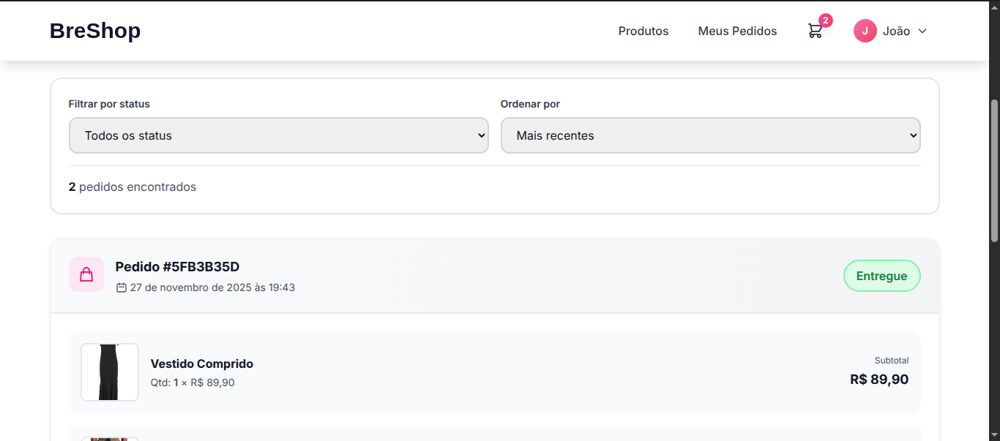

# BreShop - Plataforma de E-commerce

**Nome:** Enzo Felipe Prudencio Avelino Lima  
**Matrícula:** 20240065606

---

## 📖 Descrição do Projeto

O **BreShop** é uma plataforma de marketplace desenvolvida para facilitar a compra e venda de produtos. O sistema conecta vendedores e compradores em um ambiente intuitivo, permitindo o cadastro de produtos, gestão de carrinho de compras, processamento de pedidos e controle de estoque automatizado. O projeto foi construído utilizando uma arquitetura moderna Full Stack, separando o backend do frontend.

---

## 🚀 Tecnologias Utilizadas

### Backend
*   **Node.js** (v18+)
*   **TypeScript** (v5.x)
*   **Express** (v4.x) - Framework web robusto
*   **Prisma ORM** (v5.x) - Manipulação de banco de dados
*   **SQLite** - Banco de dados relacional (ambiente de desenvolvimento)
*   **JWT (JsonWebToken)** - Autenticação e segurança de rotas
*   **Multer** - Gerenciamento de upload de imagens

### Frontend
*   **React** (v18.x) - Biblioteca para interfaces de usuário
*   **Vite** (v5.x) - Build tool de alta performance
*   **TypeScript** - Tipagem estática para maior segurança
*   **Tailwind CSS** (v3.x) - Framework de estilização utility-first
*   **Axios** - Consumo de API
*   **Context API** - Gerenciamento de estado global (Autenticação e Carrinho)

---

## 📋 Pré-requisitos

Para executar este projeto, certifique-se de ter instalado em sua máquina:
*   [Node.js](https://nodejs.org/) (versão 18 ou superior)
*   [Git](https://git-scm.com/)

---

## 🔧 Instalação e Configuração

Como o projeto é dividido em dois repositórios, siga os passos abaixo para configurar o ambiente completo.

### 1. Clonar os Repositórios

Recomenda-se criar uma pasta raiz para organizar o projeto:

```bash
mkdir BreShop-Project
cd BreShop-Project

# Clone o Backend
git clone https://github.com/enzo-felipe0/BreShop-backend.git backend

# Clone o Frontend
git clone https://github.com/enzo-felipe0/BreShop-frontend.git frontend
```

### 2. Configuração do Backend (API)

```bash
cd backend

# 2.1 Instalar dependências
npm install

# 2.2 Configurar Variáveis de Ambiente
# Crie um arquivo .env na raiz da pasta backend e insira:
PORT=3000
DATABASE_URL="file:./dev.db"
JWT_SECRET="segredo_super_secreto_breshop"
FRONTEND_URL="http://localhost:5173"

#alguns itens do .env não estão aqui pois realmente são privados

# 2.3 Configurar Banco de Dados
npx prisma migrate dev --name init
```

### 3. Configuração do Frontend (Interface)

Abra um novo terminal para o frontend:

```bash
cd frontend

# 3.1 Instalar dependências
npm install

# 3.2 Configurar Variáveis de Ambiente
# Crie um arquivo .env na raiz da pasta frontend e insira:
VITE_API_URL="http://localhost:3000/api"
```

---

## ▶️ Instruções de Execução

Você precisará de dois terminais abertos simultaneamente.

**Terminal 1 - Backend:**
```bash
cd backend
npm run dev
```
*O servidor iniciará em: `http://localhost:3000`*

**Terminal 2 - Frontend:**
```bash
cd frontend
npm run dev
```
*A aplicação abrirá em: `http://localhost:5173`*

---

## 📂 Estrutura do Projeto

### Backend
*   `src/controllers`: Lógica das requisições (Auth, Produtos, Pedidos).
*   `src/routes`: Definição dos endpoints da API.
*   `src/services`: Regras de negócio.
*   `src/middlewares`: Autenticação e validações.
*   `prisma/schema.prisma`: Modelagem do banco de dados.

### Frontend
*   `src/pages`: Telas da aplicação (Home, Login, Dashboard, Checkout).
*   `src/components`: Componentes reutilizáveis (Navbar, ProductCard).
*   `src/contexts`: Estados globais (AuthContext, CartContext).
*   `src/services`: Configuração do Axios.

---

## ✅ Funcionalidades Implementadas

O sistema atende aos seguintes requisitos funcionais:

- [x] **Cadastro de Usuários:** Vendedor e Comprador podem criar conta com Nome, E-mail, Senha e Tipo.
- [x] **Autenticação:** Login seguro via E-mail e Senha (JWT).
- [x] **Gestão de Produtos:** Vendedor cadastra produtos com nome, descrição, preço, quantidade e upload de fotos.
- [x] **Catálogo:** Exibição pública dos produtos na Home.
- [x] **Carrinho de Compras:** Comprador adiciona itens e visualiza resumo.
- [x] **Finalização de Compra:** Registro do pedido e baixa automática no estoque.
- [x] **Histórico de Transações:**
    - Comprador visualiza suas compras.
    - Vendedor visualiza suas vendas.
- [x] **Status do Pedido:** Acompanhamento (Em processamento, Enviado, Entregue).
- [x] **Edição de Perfil:** Atualização de dados cadastrais básicos.
- [x] **Notificações:** Envio de e-mail na confirmação do pedido.

---

## 🗄️ Modelo de Dados

O banco de dados (SQLite via Prisma) possui as seguintes entidades principais:

*   **User:** Armazena dados de acesso e perfil.
*   **Product:** Dados do item à venda, relacionado ao User (vendedor).
*   **ProductPhoto:** URLs das imagens vinculadas ao Produto.
*   **Order:** Cabeçalho do pedido, vinculado ao User (comprador).
*   **OrderItem:** Itens do pedido, registrando preço no momento da compra.

*(Verifique a pasta `prisma/schema.prisma` para detalhes das relações)*

---

## 🔌 Rotas da API

*   `POST /auth/register` - Criar conta
*   `POST /auth/login` - Autenticar
*   `GET /products` - Listar produtos
*   `GET /products/:id` - Detalhes do produto
*   `POST /products` - Criar produto (Auth + Vendedor)
*   `POST /cart/checkout` - Realizar compra (Auth + Comprador)
*   `GET /orders/my-orders` - Histórico de compras
*   `GET /orders/sales` - Histórico de vendas

---

## 📸 Screenshots

Abaixo estão os links para as capturas de tela das principais funcionalidades:
  * Home:
  
  * Produtos exibidos na Home
   
   * Página de produto
  
  * Tela de Login
  
  * Carrinho
  
  * Cadastro de Produtos
   
   * Histórico de Vendas
   

   * Pedidos
   

---

## 🎥 Vídeo Demonstrativo

Confira a demonstração completa do sistema em funcionamento:
[Link para o Vídeo](https://youtu.be/Yw8EwrRXClA)

---

## 💡 Decisões Técnicas e Justificativas

1.  **Prisma + SQLite:** Escolhido pela facilidade de configuração local e excelente suporte a TypeScript, permitindo desenvolvimento ágil sem configurar servidores de banco complexos.
2.  **Tailwind CSS:** Utilizado para acelerar a estilização e garantir responsividade sem a necessidade de escrever CSS puro extenso. Além de familiaridade prévia.
3. **Ambiente JavaScript (React + Node):** Escolhi um ambiente JS devido a minha familiaridade prévia. Não queria ter surpresas indesejadas que as vezes ocorrem quando lidamos com tecnologias novas.  

---

## 🔮 Melhorias Futuras

*   Integração com gateway de pagamentos real (Stripe/Mercado Pago).
*   Sistema de chat em tempo real entre vendedor e comprador.
*   Deploy da aplicação em nuvem (Render/Vercel).
*   Implementação de testes unitários e de integração (Jest/Cypress).
